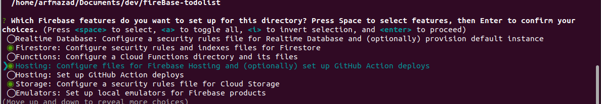
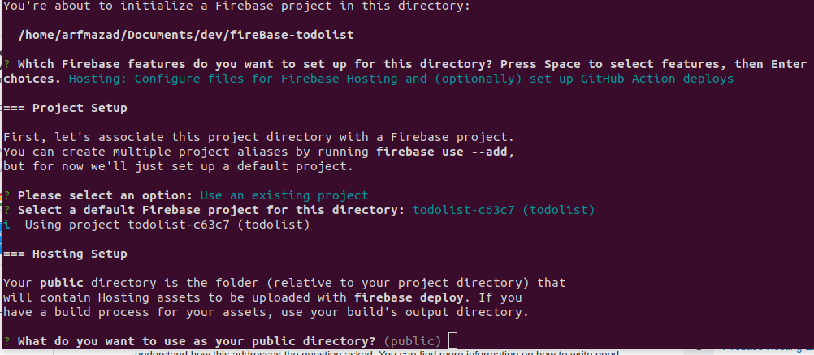
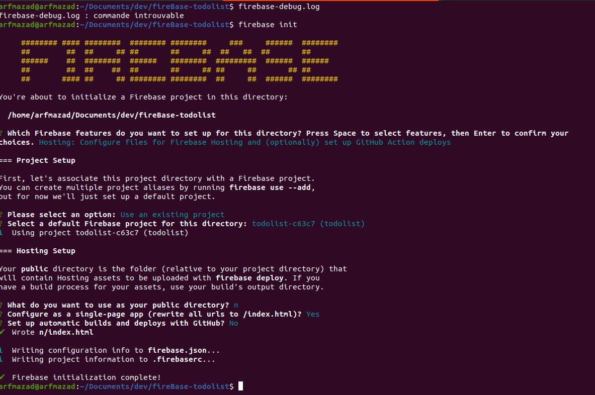
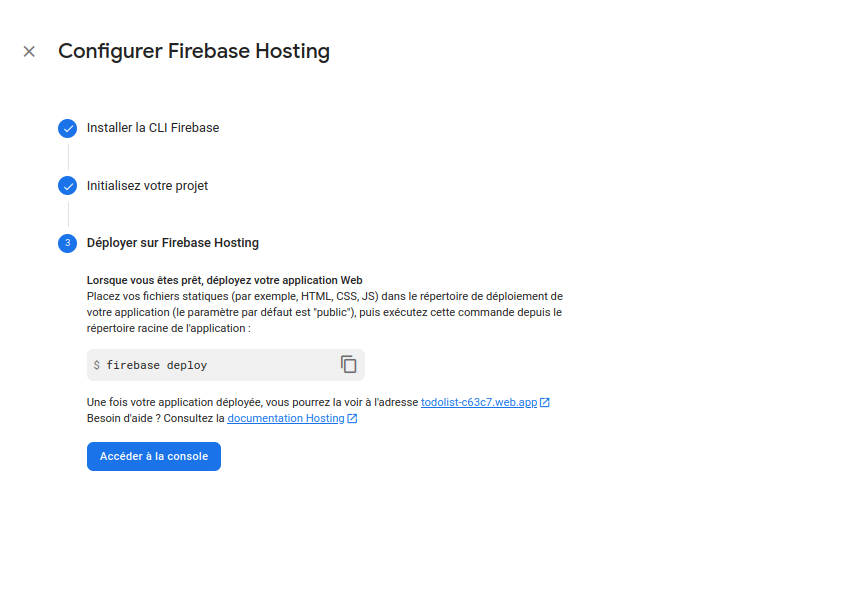
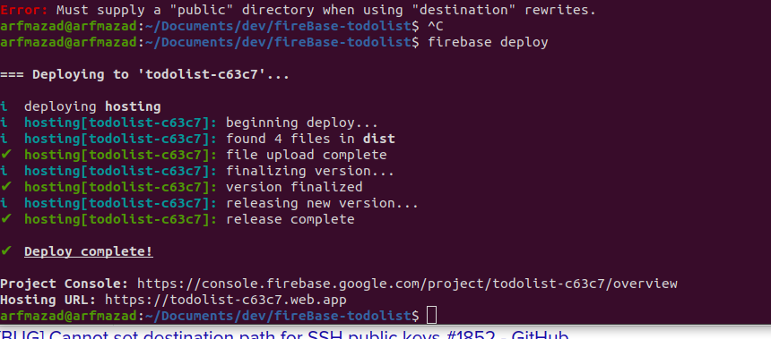

# FireBase-todolist

lun. 06 mars 2023 11:21:57 CET


**_Schéma réactif pour mémoire_**


# Installation

cloner le repository
npm install

# qui a t-il sous le capot .

1. ajouter la doc

   "dotenv"
   "firebase"
   "nanostores"
   "react"
   "react-router"
   "styled-components"
   "typescript"
   "vite"

   note :Attention gestion de dotenv est différent de nodejs

# comment s'organise le code

src-->main  
|---component  
 |---style  
 |---store  
|---type  
|---lib  
|---image

# déploiement du projet

[il est ici](URL: https://todolist-c63c7.web.app)

# creation du projet

1. création du compte sur firebase google

   Il suffit d'avoir un compte google mail et le service est gratuit jusqu'a une certaine limite.  
   Note : quand c'est gratuit, c'est que c'est toi le produit

1. creation du projet vite

   ```sh
   npm create vite@latest <nom-projet> --template
   cd nom-projet
   npm install
   ```

1. creation git et github

   ```bash
   echo "# <nom-projet>" >> README.md
   git init
   git add README.md
   git commit -m "first commit"
   git branch -M main
   git remote add origin https://github.com/podspods/<nom-projet>.git
   git push -u origin main
   ```

1. creation de la branch develop

   ```sh
   git checkout -b develop
   ```

1. creation de la branch feature-subscribe

   la branche feature-subscribe correspond au premier écran à developper

   ```sh
   git checkout -b feature-subscribe
   ```

1. ajout des bibliothèque firebase

   - Authentification fire base

   ```js
   npm i @firebase/auth
   ```

   - stockage des données sur une base noSql

   firestore

   ```js
   npm i @firebase/firestore
   ```

# developpement des screens

1. [developpement screen subscrible](./doc/screen-subscribe.md)
1. [developpement screen Connexion](./doc/screen-connexion.md)
1. [developpement screen Home](./doc/screen-Home.md)
1. [developpement screen Nouvelle liste](./doc/screen-NewList.md)
1. [developpement screen TodoList](./doc/screen-TodoList.md)
1. [developpement screen Menu](./doc/screen-Menu.md)
1. [developpement screen Mon-profile](./doc/screen-user-profile.md)

# première correction

[Lien vers la correction](https://github.com/Djeg/formation-react/tree/session-projet/06-03-23/10-03-23)  
très impormat : le schéma réaction

# mise en ligne

1. service sur fire base :

   

   

1. install firebase tools
   

   ```js
   npm install -g firebase-tools
   ```

   note : faut-il employer l'option `-g` ? ou serait-il possible de l'installer localement.

1. fire base loging
   

   ```sh
   firebase login
   ```

   attention : google demande d'acceder au compte mail : faire un compte mail différent

   ```sh
   firebase init
   ```

   

   

   

1. selection les services demandé
   hosting + storage

   option create projet ou utiliser un existant

   choisir : use an existing project

1. compiler le projet javascrip

   ```js
   npm run build
   ```

1. modifier firebase.json pour le répertoire dist

   dans le fichier firebase.json donner le répertoire a déployer
   ` "public": "dist",`

   ```js
   {
     "hosting": {
       "public": "dist",
       "ignore": [
         "firebase.json",
         "**/.*",
         "**/node_modules/**"
       ],
       "rewrites": [
         {
           "source": "**",
           "destination": "/index.html"
         }
       ]
     }
   }
   ```

1. deployer le projet
   

   ```js
   firebase deploy
   ```

1. si tout se passe bien
   

   ```sh
   Project Console: https://console.firebase.google.com/project/todolist-c63c7/overview

   ```

   ```sh
   Hosting URL: https://todolist-c63c7.web.app
   ```

## correction développé en react native

Application entierrement corrigé : https://github.com/Djeg/formation-react/tree/projet-native/19-12-22/23-12-22

# comment faire ?

1. mettre une application mobile sur store

   voir doc : doc.expo.  
   et react native dev

1. base de donnée sur le browser

   [indexbb : doc](https://developer.mozilla.org/fr/docs/Web/API/IndexedDB_API)

   [localstorage : doc localstorage nDM](https://developer.mozilla.org/en-US/docs/Web/API/Window/localStorage)

# note pour plus tard :

a voir la fonction outlet sur les react route

responsible : changer la police d'écriture de :root
ensuite utiliser les tailles de police avec les unité em et rem

[A voir le produit svelte](https://svelte.dev/) l'equivalent de react en plus simple

[doc svelte](https://svelte.dev/docs)
