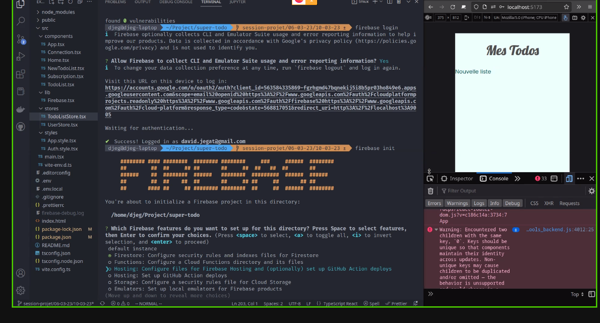

# FireBase-todolist

lun. 06 mars 2023 11:21:57 CET


**_Schéma réactif pour mémoire_**


# Installation

cloner le repository
npm install

# qui a t-il sous le capot .

1. ajouter la doc

   "dotenv"
   "firebase"
   "nanostores"
   "react"
   "react-router"
   "styled-components"
   "typescript"
   "vite"

   note :Attention gestion de dotenv est différent de nodejs

# comment s'organise le code

src-->main  
|---component  
 |---style  
 |---store  
|---type  
|---lib  
|---image

# création du compte sur firebase google

# creation du projet vite

# creation git et github

# creation de la branch develop

# creation de la branch feature-subscribe

# Authentification fire base

```js
npm i @firebase/auth
```

# firestore

```js
npm i @firebase/firestore
```

dot env

```js
npm install dotenv --save
```

# developpement branche subscribe

1. [developpement screen subscrible](./doc/screen-subscribe.md)
1. [developpement screen Connexion](./doc/screen-connexion.md)
1. [developpement screen Home](./doc/screen-Home.md)
1. [developpement screen Nouvelle liste](./doc/screen-NewList.md)
1. [developpement screen TodoList](./doc/screen-TodoList.md)
1. [developpement screen Menu](./doc/screen-Menu.md)
1. [developpement screen Mon-profile](./doc/screen-user-profile.md)

# première correction

[Lien vers la correction](https://github.com/Djeg/formation-react/tree/session-projet/06-03-23/10-03-23)
très impormat : le schéma réaction

Composant-> Action->State

a voir la fonction outlet sur les react route

responsible : changer la police d'écriture de :root
ensuite utliser em et rem

[note : a voir la documentation sur svelte ](https://svelte.dev/)

doc svelte https://svelte.dev/docs

# mise en ligne

service sur fire base :


install firebase tools


```js
npm install -g firebase-tools

```

fire base loging

```sh
firebase init
```

autentification



```js
npm run build
```

modifier firebase.json pour le répertoire dist

```js
firebase deploy
```

hosting commencez
install un otuils
firebase init

dossier à mettre en ligne : dossier dist

npm run build pour créer le dossier dist

firebase->login défnit le droit de mise en ligne

## correction développé en react native

Application entierrement corrigé : https://github.com/Djeg/formation-react/tree/projet-native/19-12-22/23-12-22

# mettre une application mobile sur store

voir doc : doc.expo.  
et react native dev

base de donnée sur le browser

[indexbb : doc](https://developer.mozilla.org/fr/docs/Web/API/IndexedDB_API)

[localstorage : doc localstorage nDM](https://developer.mozilla.org/en-US/docs/Web/API/Window/localStorage)
